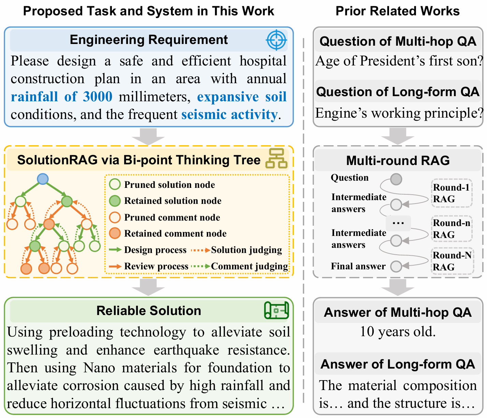
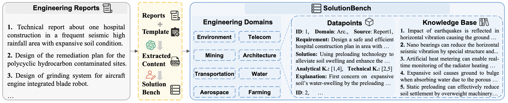
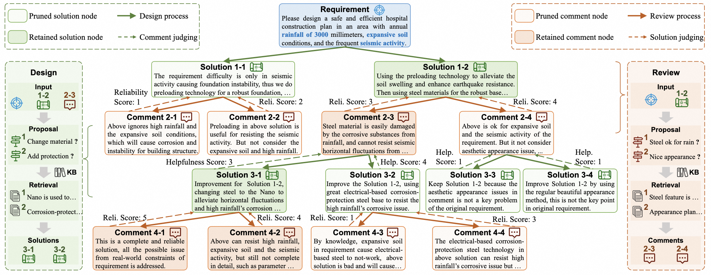

# DeepSolution
DeepSolution: Boosting Complex Engineering Solution Design via Tree-based Exploration and Bi-point Thinking         
https://arxiv.org/abs/{waiting}


## 0. Introduction
<!-- Designing solutions for complex engineering challenges is crucial in human production activities. 
However, previous research in the retrieval-augmented generation (RAG) field has not sufficiently addressed tasks related to the design of complex engineering solutions. 
To fill this gap, we introduce a new benchmark, SolutionBench, to evaluate a system’s ability to generate complete and feasible solutions for engineering problems with multiple complex constraints. 
To further advance the design of complex engineering solutions, we propose a novel system, SolutionRAG, that leverages the tree-based exploration and bi-point thinking mechanism to generate reliable solutions. 
 -->
<table style="border: none; border-collapse: collapse;">
  <tr>
    <td style="border: none; vertical-align: top;">
      Designing solutions for complex engineering challenges is crucial in human production activities. 
      However, previous research in the retrieval-augmented generation (RAG) field has not sufficiently addressed tasks related to the design of complex engineering solutions. 
      To fill this gap, we introduce a new benchmark, SolutionBench, to evaluate a system’s ability to generate complete and feasible solutions for engineering problems with multiple complex constraints. 
      To further advance the design of complex engineering solutions, we propose a novel system, SolutionRAG, that leverages the tree-based exploration and bi-point thinking mechanism to generate reliable solutions.
    </td>
    <td style="border: none; vertical-align: top;">
      
    </td>
  </tr>
</table>

## 1. SolutionBench
The SolutionBench is in ```benchmark```. The constrcution process is as illustrated in the figure, we first collect engineering technical reports about complex solution design from authoritative journals across various engineering fields. Then, based on manually formatted extraction templates, we use powerful LLMs to implement useful content extraction. Finally, after  manually checking and removing redundancy, the extracted content is integrated into a complete benchmark.


## 2. SolutionRAG
Since the improvement process from a suboptimal solution to a reliable one is flexible and lacks a fixed reasoning pattern, SolutionRAG performs tree-base exploration to find the most effective improvement process for each input requirement.
Moreover, due to the multiple real-world constraints within the requirements, the system cannot directly guarantee the generated solutions satisfy all constraints. Therefore, SolutionRAG employs a bi-point thinking approach, alternating between solution design and review, gradually enhancing the solution’s completeness and reliability.
Finally, to balance inference performance and efficiency, SolutionRAG employs node evaluation to prune the tree, ensuring that the inference process follows the most promising solutions and the most helpful reviewed comments. 


### 2.1 Environment Installation
```bash
python=3.10.16
pip install -r requirements.txt
pip install vllm==0.6.6.post1
```

### 2.2 Base Model Employment
```bash
# employ the base model as API for convenient experiments, will get qwen_url
model=Qwen2.5-7B-Instruct
CUDA_VISIBLE_DEVICES=0,1,2,3 OUTLINES_CACHE_DIR=tmp_257b nohup python -m vllm.entrypoints.openai.api_server --model ${model} --served-model-name Qwen --tensor-parallel-size 4 --port 1225 --gpu_memory_utilization 0.45 --disable-custom-all-reduce > vllm_257b.log 

```

### 2.3 Embeddings Preparation
```bash
# generate embeddings for each knowledge base corpus
python eval_0_prepare_embeddings.py
```

### 2.4 SolutionRAG Running
```bash
# generate solutions, outputs will be in eval_results
scenario="0_test" # 1_environment, 2_mining, 3_transport, 4_aerospace, 5_telecom, 6_architecture, 7_water, 8_farming
python eval_5_ours.py --qwen_url ${qwen_url} --scenario ${scenario}
```

### 2.5 Score Calculation and Showing
```bash
# eval and show scores for output solutions based on GPT-4o
python eval_score_calculate.py
python eval_score_show.py        
```